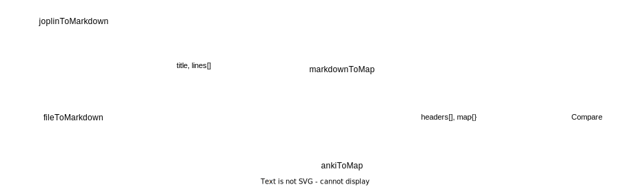

# Joplin To Anki

Script to create & update Anki notes based on content in Joplin notes.
`python`

## How it works



In Joplin, and other Markdown editors, it's possible to create tables.

The following Markdown:
```markdown
|Country|Capital|
|-------|-------|
|Netherlands|Amsterdam|
|Germany|Berlin|
```

Would result in this table:

|Country|Capital|
|-------|-------|
|Netherlands|Amsterdam|
|Germany|Berlin|

The script scans Joplin notebooks for any such tables and exports them into a format that can be easily imported into Anki as notes.

## Setup

## About Tags

If your Joplin notebook has headings as seen below, they will automatically be added as nested tags.
```markdown
# Heading 1
## This is h2
x
```

In this case, notes created from the location of `x` would have the tag `heading-1::this-is-h2`.
You can find these notes in Anki by searching for either `heading-1` or `heading-1::this-is-h2`.
There is a bit of an edge case to be aware of here: if you're updating existing notes, the existing list of tags in Anki will be overwritten.
To get around this, any of these options work:

- disable updating existing notes when importing in Anki
- just don't set other tags for the notes inside Anki
- disable writing tags in this script by calling it `joplin-to-anki.py --no-heading-tags` **TODO**
- have a Tags column inside Joplin with the values you want to see in Anki

## Edge Cases

- tags are treated like any other field: they show up as differences unless "dontshowifsim" is set
- missing fields are counted as differences
- the 'mnemonic' field in anki is always ignored
- tag comparison for j2aref is not functional TODO

# Joplin To Hugo

I use the Hugo framework to publish my website. Though both Joplin and Hugo use the Markdown format, I wanted a tool for additional converstions.

- a Joplin add-on allows `++underlines++`, while I use a shortcode for this in Hugo
- in some cases, I want one Joplin notebook published as one webpage
- the Hugo template I use already displays the page title. H1 headings would duplicate this.

Instructions (mostly for myself):

1. In `readconfig.py`, define the Joplin note or notebook to be published.
	- leave the Anki field empty if you don't want to also sync with an Anki deck
	- the define the filename to be written to in the `hugo` subdirectory
2. In the Hugo website repository, run `git checkout source`
3. Create the desired page using `hugo new content/page.md`
4. Symlink the two files. It's best if the file in J2H points to the Hugo file. `ln -s`
5. Run `./toHugo.py`
6. In the Hugo repo, `git add` and `git commit`
7. In the Hugo repo, `git checkout master`
8. Run `hugo new content/page.md` again and commit.
9. Finally, `git rebase source master`.
	- add any Hugo-specific changes here
